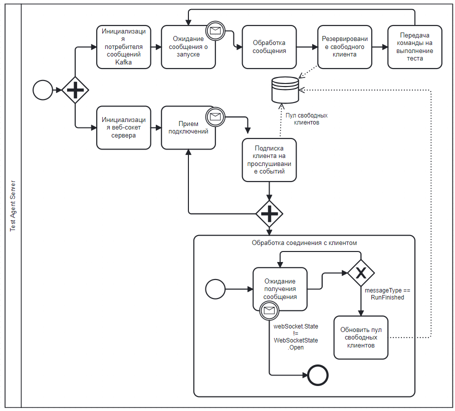

# Dotnet testing automation framework using a test management system
### Component diagram

### Test agent
- WebSocket client;
- Execute bash comand for start test execution (dotnet text --filter "Name~{testId}");

- Load Allure report result from test build directory into TMS;

### Test Server
- WebSocket server;
- Kafka Consumer;

### Overview
The work is part of a master's thesis. Its full text can be found in the readme section.
